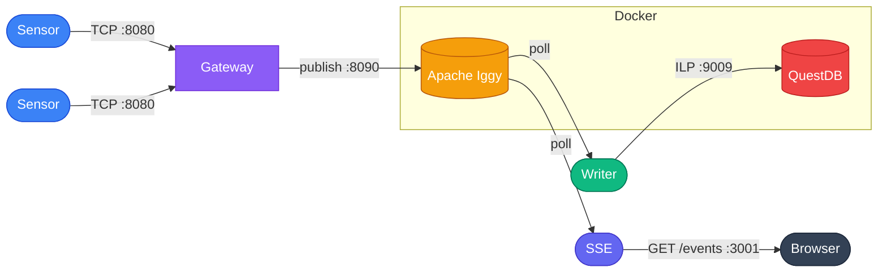

# Rotor

A real-time 3D UAV tracking interface built with Svelte and Three.js. Displays live position data for multiple UAVs across X, Y, and Z coordinates. Backed by a simulated IoT sensor pipeline in Rust — sensors stream readings to a gateway over TCP, which publishes to Apache Iggy. A writer persists readings to QuestDB; an SSE server streams them to the browser.

## Stack

- **`ui/`** — Svelte + Vite + Three.js
- **`server/`** — Rust (sensor, gateway, writer, sse)

## Architecture



- **Sensor** — simulates a UAV position sensor. Generates a stable UUID on startup and emits randomised X/Y/Z readings at a set frequency over TCP using a length-prefixed binary protocol. Multiple instances can run simultaneously.
- **Gateway** — TCP server that accepts connections from multiple sensors concurrently. Validates and batches payloads, then publishes to Apache Iggy.
- **Writer** — polls Iggy and persists each `UavReading` to the `uav_position` table in QuestDB via the InfluxDB line protocol.
- **SSE** — polls Iggy and streams `UavReading` messages as Server-Sent Events to browser clients on `GET /events`.

## Reading format

`UavReading` — emitted by each sensor instance:

| Field        | Type   | Notes                        |
|--------------|--------|------------------------------|
| `id`         | UUID   | stable per sensor process    |
| `x`          | `f32`  | −50 m to 50 m                |
| `y`          | `f32`  | −10 m to 55 m                |
| `z`          | `f32`  | −50 m to 50 m                |
| `created_at` | `i64`  | nanoseconds since Unix epoch |

## Prerequisites

- Rust (edition 2024 — toolchain 1.85+)
- Docker + Docker Compose (for Iggy and QuestDB)
- Node.js (for the UI)

## Setup

1. Create a `.env` file in the repo root:

   ```bash
   # Iggy credentials — used by docker-compose and by gateway/writer/sse at runtime
   IGGY_ROOT_USERNAME=iggy
   IGGY_ROOT_PASSWORD=dev-iggy-password

   # Iggy stream/topic topology — shared by gateway, writer, and sse
   IGGY_STREAM_NAME=sample-stream
   IGGY_TOPIC_NAME=sample-topic
   IGGY_PARTITION_ID=0

   # QuestDB connection string — used by writer
   QDB_CLIENT_CONF=http::addr=localhost:9000;
   ```

   `.env` is gitignored.

2. Start Iggy and QuestDB:

   ```bash
   docker-compose up -d
   ```

   | Service           | Endpoint                                      |
   |-------------------|-----------------------------------------------|
   | Iggy TCP          | `127.0.0.1:8090`                              |
   | Iggy HTTP API     | `127.0.0.1:3000`                              |
   | QuestDB console   | [http://localhost:9000](http://localhost:9000) |
   | QuestDB ILP       | `127.0.0.1:9009`                              |

## Running

**UI**

```bash
cd ui
npm install
npm run dev
```

**Server** — run each in a separate terminal:

```bash
# 1. Gateway — listens on 127.0.0.1:8080, forwards to Iggy
cargo run --bin gateway

# 2. Writer — polls Iggy, writes to QuestDB
cargo run --bin writer

# 3. SSE — polls Iggy, serves Server-Sent Events on 127.0.0.1:3001
cargo run --bin sse

# 4. Sensor(s) — each instance connects to the gateway and emits readings
# Usage: sensor <frequency_seconds>
cargo run --bin sensor 5
cargo run --bin sensor 3
```

The gateway batches every 10 readings into a single Iggy publish. Each sensor spawns with a unique UUID that identifies its readings for the lifetime of the process.

## Resetting state

To wipe all persisted data (Iggy stream history and QuestDB tables):

```bash
docker-compose down -v
docker-compose up -d
```
