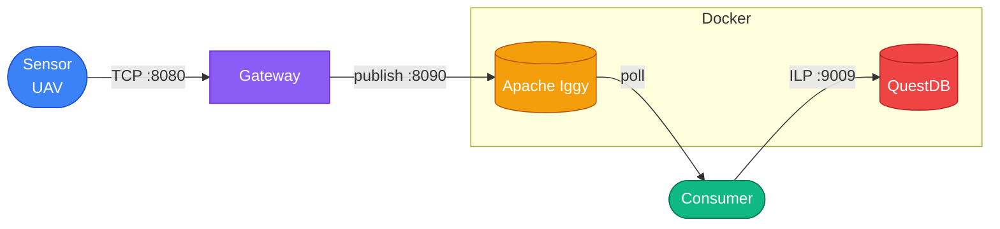

# Rotor

A real-time 3D UAV tracking interface built with Svelte and Three.js. Displays live position data for multiple UAVs across X, Y, and Z coordinates in a futuristic heads-up display. Backed by a simulated IoT sensor data pipeline built in Rust, with sensors producing readings at configurable intervals and stream them to a central gateway over TCP. The gateway publishes readings to Apache Iggy, and a consumer writes them to QuestDB for time-series storage.

## Stack

- **`ui/`** — Svelte + Three.js
- **`server/`** — Rust (sensor pipeline, gateway, message broker)

## Architecture



- **Sensor** — simulates a UAV position sensor, generates randomized X/Y/Z readings at a set frequency, and streams them to the gateway using a length-prefixed binary protocol.
- **Gateway** — TCP server that accepts connections from multiple sensors concurrently. Validates incoming payloads and acts as an [Apache Iggy](https://iggy.apache.org) producer, forwarding sensor readings into a message stream.
- **Consumer** — polls the Iggy topic and writes readings to [QuestDB](https://questdb.io) via the InfluxDB line protocol.

## Reading format

`UavReading` — emitted by each sensor instance:

| Field        | Type    | Range              |
|--------------|---------|--------------------|
| `id`         | UUID    | per-sensor, fixed  |
| `x`          | `f32`   | −50 m to 50 m      |
| `y`          | `f32`   | −10 m to 55 m      |
| `z`          | `f32`   | −50 m to 50 m      |
| `created_at` | `i64`   | nanoseconds (Unix) |

## Prerequisites

- Rust (edition 2024 — toolchain 1.85+)
- Docker + Docker Compose (for Iggy and QuestDB)
- Node.js (for the UI)

## Setup

1. Create a `.env` file in the repo root:

   ```bash
   # Iggy server credentials — used by docker-compose to bootstrap the root user
   # and by the gateway/consumer at runtime via dotenvy
   IGGY_ROOT_USERNAME=iggy
   IGGY_ROOT_PASSWORD=dev-iggy-password

   # Iggy stream/topic topology — shared by gateway and consumer
   IGGY_STREAM_NAME=sample-stream
   IGGY_TOPIC_NAME=sample-topic
   IGGY_PARTITION_ID=0

   # QuestDB connection string — used by the consumer
   QDB_CLIENT_CONF=http::addr=localhost:9000;
   ```

   `.env` is gitignored.

2. Start Iggy and QuestDB:

   ```bash
   docker-compose up -d
   ```

   | Service           | Endpoint                                          |
   |-------------------|---------------------------------------------------|
   | Iggy TCP          | `127.0.0.1:8090`                                  |
   | Iggy HTTP API     | `127.0.0.1:3000`                                  |
   | QuestDB console   | [http://localhost:9000](http://localhost:9000)     |
   | QuestDB ILP       | `127.0.0.1:9009`                                  |

## Running

**UI**

```bash
cd ui
npm install
npm run dev
```

**Server** — run each in a separate terminal:

```bash
# 1. Gateway — listens on 127.0.0.1:8080 for producers, forwards to Iggy
cargo run --bin gateway

# 2. Writer — polls the Iggy topic and writes to QuestDB
cargo run --bin writer

# 3. Sensor — connects to the gateway and emits UAV position readings
# Usage: sensor <frequency_seconds>
cargo run --bin sensor 5
```

The gateway batches every 10 readings into a single Iggy publish. The consumer writes each reading to the `uav_position` table in QuestDB.

## Resetting state

To wipe all persisted data (Iggy stream history and QuestDB tables):

```bash
docker-compose down -v
docker-compose up -d
```
